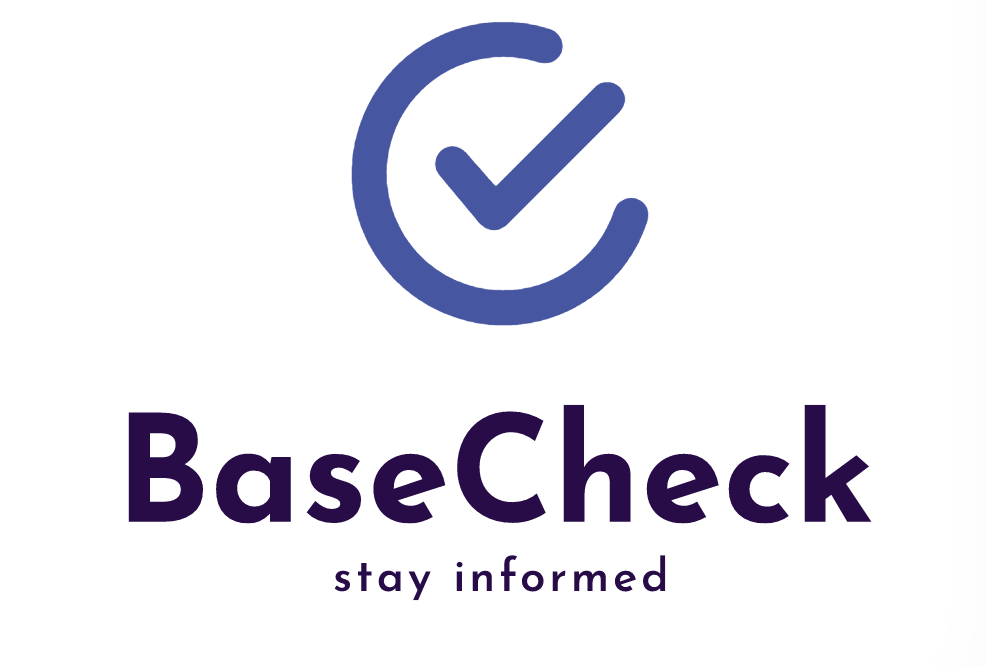

# INFO 442 Team B

**Team Name:** Team BaseCheck

## Team Members

* Grady Thompson (Project Manager)
* Shareen Chang (Designer)
* Akoly Vongdala (Developer)
* Trey Michaels (Developer)

## Mission Statement

Ensuring that every person has an accessible opportunity to stay well-informed about the pandemic

## Problem Statement

While the COVID-19 pandemic spans across the globe, the situation varies from country to country, state to state, and even city by city. Total case and death numbers are widely reported in the news and on social media, but finding local case information can be challenging. People can use the COVID-19 tracker provided by the CDC, but it is oftentimes providing non-user-specific information in that the user has to search by their state and filter down to their area which can be daunting and time consuming. With that, how can we provide a simple way to disseminate critical information about COVID-19 to concerned individuals, families, and essential workers who may be more at risk to exposure from their external environment, helping them to make informed decisions and understand the risks associated with leaving their homes?
