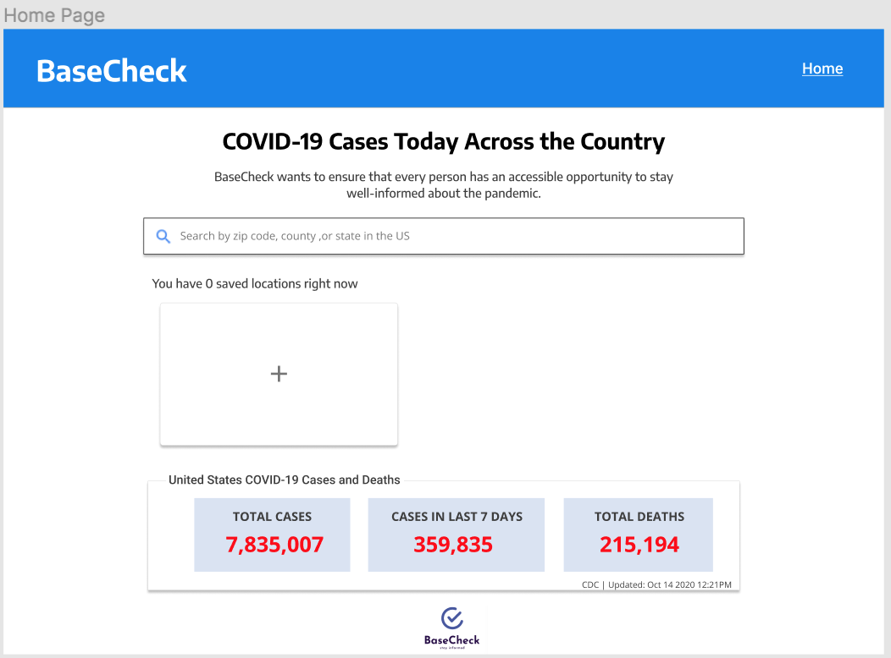
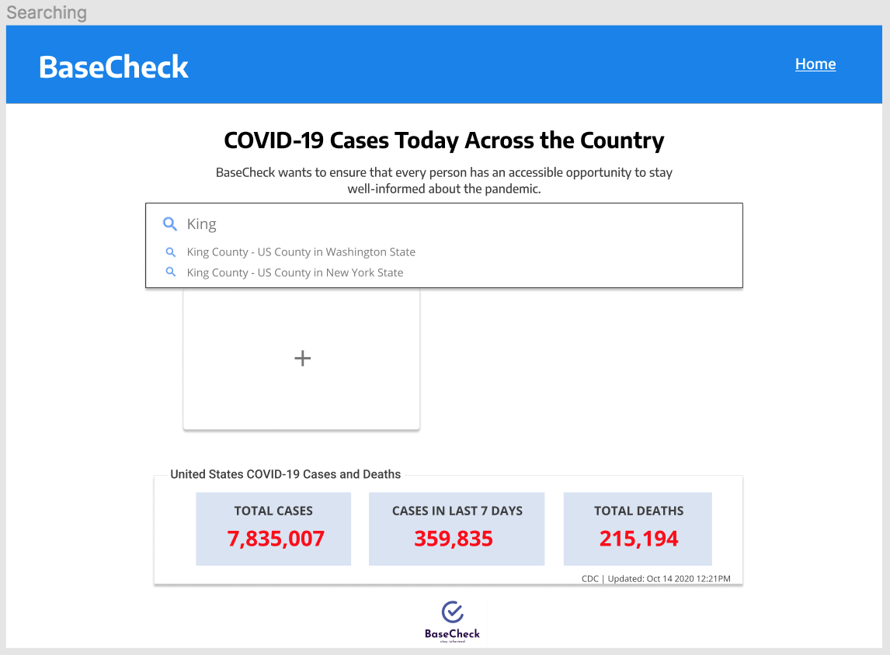
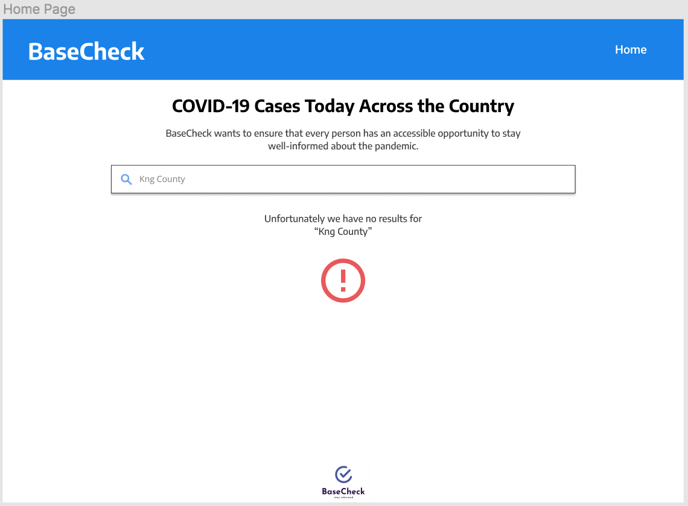
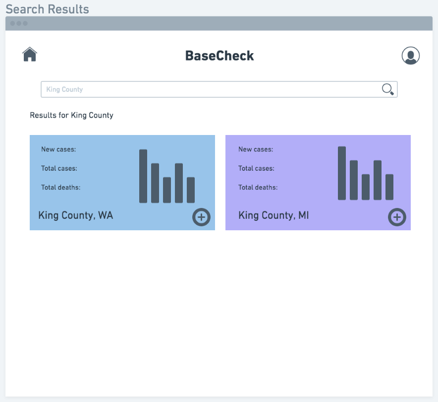
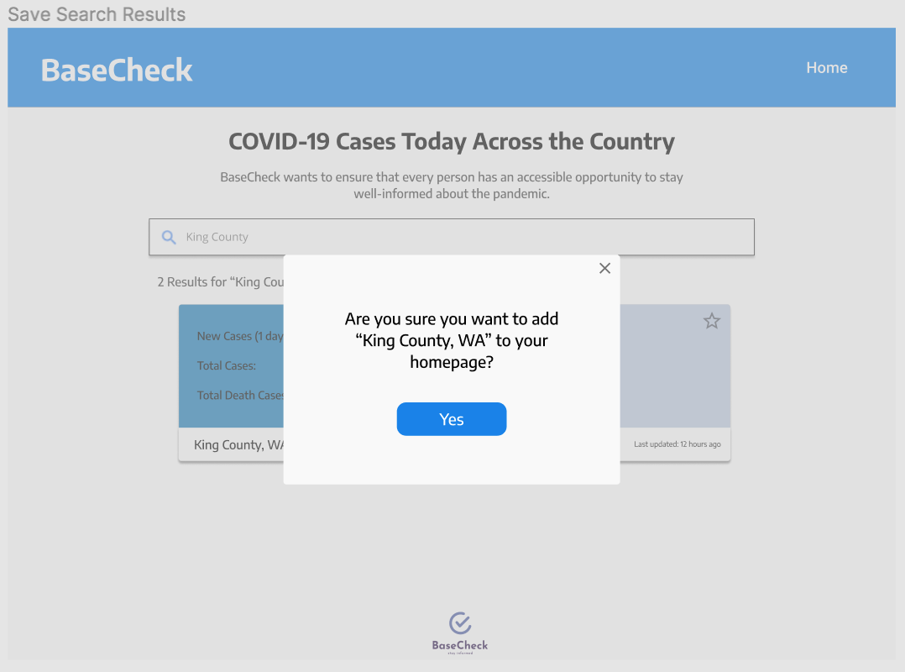
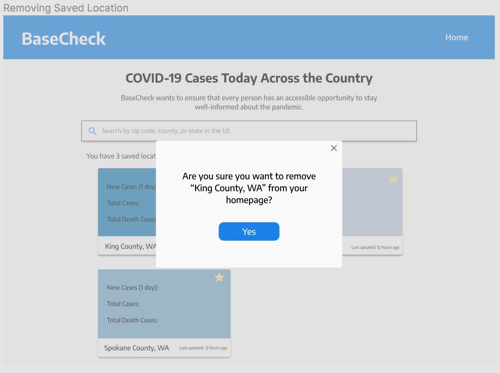
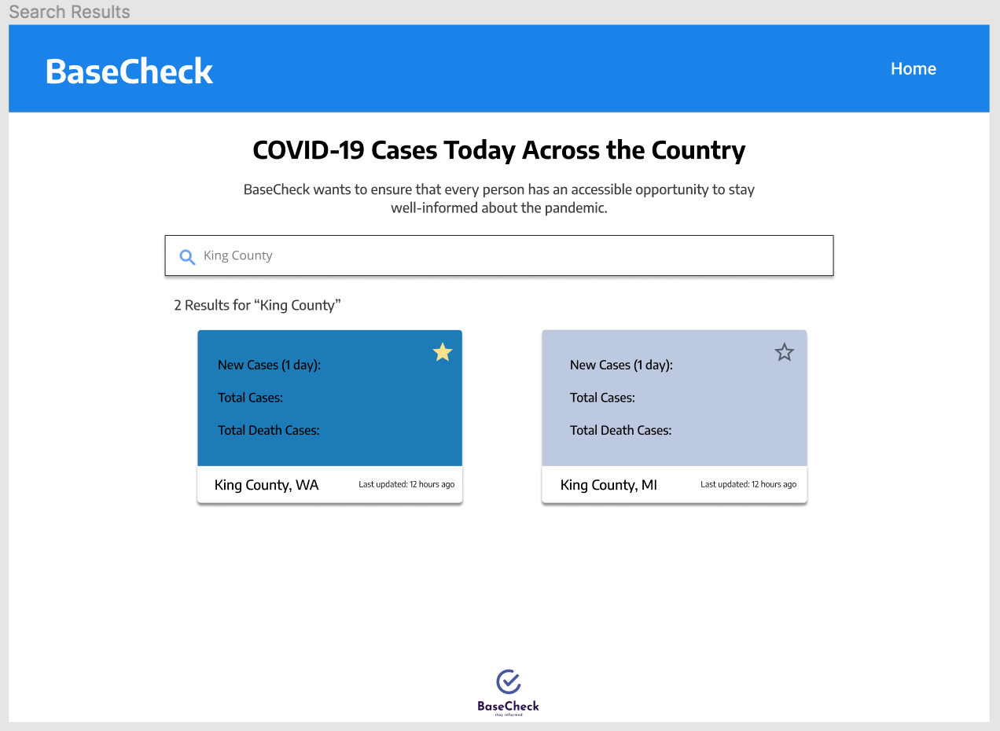
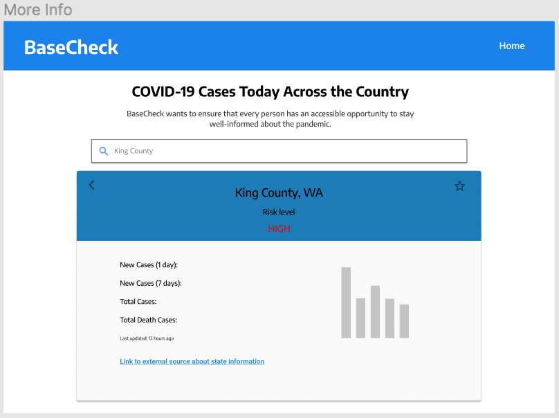

# Homework 2: Design

## Problem Statement

While the COVID-19 pandemic spans across the globe, the situation varies from country to country, state to state, and even county by county. Total case and death numbers are widely reported in the news and on social media, but finding local/county case information like total cases, death, and risk factors can be challenging. People can use the COVID-19 tracker provided by the CDC, but if users want to know about the COVID status in their own specific county, since there is no search function, users have to manually scroll through a long list of counties in America or use the map functionality to slowly hover through each area to find a specific county. This can be frustrating for users who live in a state with many counties such as Texas which has 254 counties. The time it takes to find a location could lead to a user getting discouraged and giving up, or a user not being able to check as frequently. Without the search functionality users can end up spending more time looking for their specific county COVID-19 cases, death, and risk factors which are important information to concerned individuals, families, and essential workers who may be more at risk to exposure from their external environment. We need to utilize digital technology to enhance public health education and help individuals to make informed decisions and understand the risks associated with leaving their homes during COVID times [1]. Being able to search for counties would allow users to quickly and more frequently check the COVID-19 cases, death, and risk levels in their area or other areas of interest, so they can be informed about the risk for themselves and people they care about.

[1] Ting, D.S.W., Carin, L., Dzau, V. and Wong, T.Y. 2020. Digital technology and COVID-19. _Nature Medicine_. 26, 4 (Apr. 2020), 459–461. DOI:https://doi.org/10.1038/s41591-020-0824-5.

## Solution

We envision a website application that shows the risk levels of different counties as well as states in America. Users will be able to search for a specific county, view COVID related risk information, and choose to add that county to their dashboard. For each county, users will be able to see new cases in the last 7 days, total cases, total death cases and risk factors. Users would also have the choice to sign up for an account so that their saved locations appear on their dashboard.

We will retrieve our data from a free API, [Novel COVID API](https://disease.sh/), that provides COVID-19 data for both the U.S. and specific counties.

The main screen prompts the user to search a county within America. Below the search bar, there is also a section that mentions the United States COVID statistics that users can click into for more information.

The user can search for a county by typing in the search bar, the search bar has autocomplete so that related location with the words typed in will appear. The user can then choose a location from the dropdown list or hit the magnifying glass to search. If the user does not type in an existing location, the page will have no results.

After the user searches for a county, the website will pop up related results. Each box contains important COVID information such as new cases, total cases, total death cases, and risk factor. The color in each box represents the risk levels associated with each county (we have not yet figured out the color scheme we want to use). If a user were to search for another location, the results on the screen will not disappear until the user hits enter or the magnifying glass.

If the user wants to add and save a location to their dashboard, the user clicks on the star button. A popup box will appear to have the user confirm that they want to save the location to their homepage.

Once the user has saved locations, they will be able to see all added locations in their homepage. The user can also click the “Home” button to be taken to their homepage. This allows the user to see an overview of COVID situations in multiple counties without clicking to additional sources. To remove a location from your homepage, just simply click on the filled in star to remove any location users no longer wish to see. When some counties are persisted on the dashboard, they will be displayed first in the search results along with the rest of the results.

If the user wishes to see more information, the user can simply click into each box which will display detailed information as well as an external link to overall state-level statistics to guide the user to other additional information that we do not provide on our site.

The graph on the more information page will display a number of cases in the 7 days. The goal of our website is not to give all COVID related information, it is to provide simple and essential information for users to understand and assess their risk in each area.
